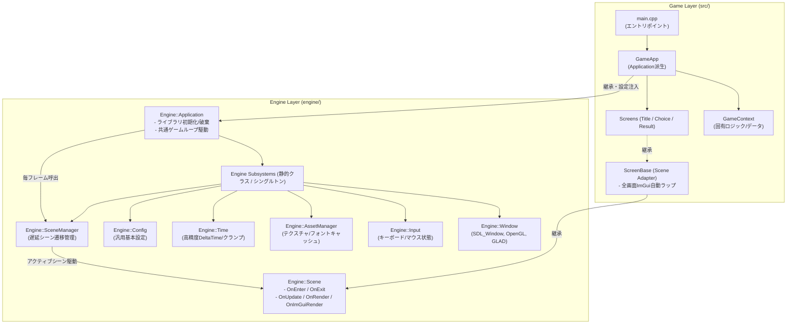

# ゲームエンジン開発サイクル 第2作目 アーキテクチャ改修レポート

## 1. はじめに：開発サイクルの背景と目的

本ドキュメントは、ゲームエンジン内製化サイクルにおける**第2作目（[`tech.c_gr.3_sat56_1st.sem_erabu`](https://github.com/junya005/tech.c_gr.3_sat56_1st.sem_erabu)）**で実施した、エンジン共通機能の統合およびアーキテクチャ刷新に関する技術レポートです。

本プロジェクトのエンジン部は、将来的にゲーム固有の実装から完全に分離し、**独立した正式なゲームエンジンリポジトリ**として切り出すことを前提として設計されています。

---

## 2. 開発サイクルにおける進化の系譜

本サイクルにおける各段階のアーキテクチャの変遷を以下に整理します。

### 比較表：1作目から2作目改修後への進化

| 項目 | 第1作目（[`tobasu`](https://github.com/junya005/tech.c_gr.3_sat56_1st.sem_tobasu)） | 第2作目 改修前（[`erabu`](https://github.com/junya005/tech.c_gr.3_sat56_1st.sem_erabu)） | 第2作目 改修後（本改修） |
| :--- | :--- | :--- | :--- |
| **レンダリング基盤** | SDL2 2D レンダラー（`SDL_Renderer`） | OpenGL 3.2 Core + GLAD + ImGui | OpenGL 3.2 Core + GLAD + ImGui（3D拡張準備済） |
| **エントリポイント (`main.cpp`)** | 初期化・テクスチャ読込・ループがベタ書き | 約280行の初期化・ImGui設定・ループがベタ書き | **`GameApp app; return app.Run();` の数行に集約** |
| **アプリケーション基底** | なし（手続き型） | なし（手続き型） | **`Engine::Application`（ライフサイクルフック提供）** |
| **サブシステム管理** | ローカル変数生成＆引き回し | `AppContext` にポインタを詰めバケツリレー | **全サブシステムが静的アクセサを提供（シングルトン）** |
| **時間管理（DeltaTime）** | 未実装（フレーム非同期） | 未実装（フレーム非同期） | **`Engine::Time`（高精度タイマー・クランプ制御）** |
| **シーン・画面遷移** | なし（単一ループ） | `switch (ScreenState)` による手動分岐 | **`Engine::SceneManager`（安全な遅延シーン遷移）** |
| **エンジンの結合度** | プロダクト固有コードと密結合 | タイトル名やフォントパスがハードコード | **完全に疎結合（設定注入・独立リポジトリ化対応）** |

---

## 3. アーキテクチャ構造図



---

## 4. 主要な設計変更点と技術的ハイライト

### ① `Engine::Application` による初期化・ゲームループのカプセル化
第1作目および第2作目初期では、低レベルライブラリ（SDL2, OpenGL, GLAD, ImGui）の初期化やメインループが `main.cpp` に直接記述されていました。
これを基底クラス [`Engine::Application`](../engine/Application.h) に集約しました。

- **初期化処理の統一**: `SDL_Init`、OpenGLコンテキスト属性、GLADロード、ImGuiコンテキスト初期化を自動実行。
- **仮想ライフサイクルフック**:
  - `OnInit()`: ゲーム固有の初期化（フォント追加、初期シーン設定など）
  - `OnShutdown()`: ゲーム終了時のクリーンアップ
  - `OnUpdate(deltaTime)`: フレーム更新ロジック
  - `OnRender()`: 生OpenGLによる直接描画（3Dモデル描画など）
  - `OnImGuiRender()`: ImGuiによるUI描画

ゲーム側は [`GameApp`](../src/GameApp.h) を派生させるだけで動作し、`main.cpp` は数行の極限までスリムなエントリポイントになりました。

---

### ② サブシステム群の静的クラス化・シングルトン化
第1作目のローカル変数生成、第2作目初期の `AppContext` による生ポインタのバケツリレーを解消し、主要サブシステムを静的クラス（シングルトン）として再設計しました。

- **[`Engine::Window`](../engine/Window.h)**:
  `SDL_Window*` だけでなく、`SDL_GLContext` の生成・管理、GLADの初期化、垂直同期（VSync）、バッファスワップ（`SwapBuffers()`）を内包し、静的アクセサ（`Window::Width()`, `Window::Height()` 等）を提供。
- **[`Engine::Input`](../engine/Input.h)**:
  毎フレームのキー状態更新と判定（`Input::GetKey()`, `Input::GetKeyDown()`）をどこからでも直接利用可能。
- **[`Engine::AssetManager`](../engine/AssetManager.h)**:
  重複ロードによる VRAM リークを防ぐテクスチャキャッシュ（`LoadTexture()`）を実装。
- **[`Engine::Time`](../engine/Time.h)**:
  1作目には存在しなかった時間管理システム。`SDL_GetPerformanceCounter` を用いた高精度デルタタイム計測、総経過時間計測、およびデバッグ停止時などの巨大スパイクを防ぐ最大時間クランプ処理を実装。

---

### ③ 描画パイプラインの3層分離
ゲームループにおける描画順序の曖昧さを解消し、将来的な 3D 描画への拡張にも対応できる厳密なパイプラインを構築しました。

```
[Frame Start]
  │
  ├─ 1. SDL_PollEvent & Input / ImGui イベントディスパッチ
  ├─ 2. Time::Update() （高精度デルタタイム計算）
  ├─ 3. Input::OnBeginFrame()
  │
  ├─ 4. ロジック更新: Application::OnUpdate(dt) & SceneManager::Update(dt)
  │
  ├─ 5. 画面クリア: glClear(GL_COLOR_BUFFER_BIT | ...)
  ├─ 6. 直接描画: Application::OnRender() & SceneManager::Render() （3D/生OpenGL）
  │
  ├─ 7. ImGuiフレーム開始: ImGui::NewFrame()
  ├─ 8. UI描画: Application::OnImGuiRender() & SceneManager::OnImGuiRender()
  ├─ 9. ImGui描画発行: ImGui_ImplOpenGL3_RenderDrawData()
  │
  └─ 10. バッファスワップ: Window::SwapBuffers()
[Frame End]
```

---

### ④ 汎用シーンマネージャー（`Engine::SceneManager`）とアダプター構造
第2作目初期の `switch (ScreenState)` による手動切り替えを廃止し、エンジン層に汎用シーンシステムを新設しました。

- **[`Engine::Scene`](../engine/Scene.h)**:
  ライフサイクル（`OnEnter`, `OnExit`, `OnUpdate`, `OnRender`, `OnImGuiRender`）を持つ抽象基底クラス。
- **[`Engine::SceneManager`](../engine/SceneManager.h)**:
  安全な遅延遷移（Pending Transition）を採用。更新・描画の実行途中でシーンが破棄されてクラッシュするのを防ぎ、フレーム先頭の安全な区切りで `OnExit()` と `OnEnter()` を順序正しく呼び出します。
- **[`ScreenBase`](../src/screen/ScreenBase.h) のアダプター化**:
  既存の `ScreenBase` が `Engine::Scene` を継承し、全画面ImGuiキャンバスの作成を自動ラップすることで、既存の各画面（`TitleScreen`, `ChoiceScreen`, `ResultScreen`）のロジックを**1行も変更することなく完全移行**させました。

---

### ⑤ エンジン部の完全な汎用化・独立リポジトリ化対応
エンジン部を将来的に正式リポジトリへ切り出すため、エンジンコード内に残っていたプロジェクト固有情報を完全に排除しました。

- **[`Engine::AppConfigData`](../engine/Config.h) の純粋化**:
  タイトル名 `"QTSRPG"`、フォントパス、ゲーム用クリアカラーをデフォルト値から完全削除し、ニュートラルなエンジン汎用値に統一。
- **設定注入アーキテクチャ**:
  [`Engine::Application`](../engine/Application.h) コンストラクタで `AppConfigData` を受け取り、[`GameApp`](../src/GameApp.cpp) の初期化子からプロジェクト固有値（タイトル `"QTSRPG"`、クリアカラー等）を注入。
- **フォント責務の分離**:
  エンジン側でのフォント決め打ち読み込みを撤廃し、ゲーム固有フォント（`PottaOne-Regular.ttf`）は `GameApp::OnInit()` 内で明示的に追加する設計としました。

---

## 5. 今後の展望（独立エンジンリポジトリ化へのロードマップ）

1. **ディレクトリの完全分離**:
   `engine/` ディレクトリを独立した Git リポジトリ（例: `YamanekoEngine`）へ切り出し、Git Submodule または CMake FetchContent / vcpkg パッケージとして各作品から参照できるようにする。
2. **シェーダー / 3Dモデル描画パイプラインの標準化**:
   `assimp` を利用した 3D モデルローダーおよびメッシュ描画クラスを `engine/` に追加し、`OnRender()` フックを活用した 3D レンダリングを正式サポートする。
3. **オーディオサブシステムの統合**:
   SDL_mixer または SoLoud 等を用いた音響管理サブシステム（`Engine::Audio`）の追加。
